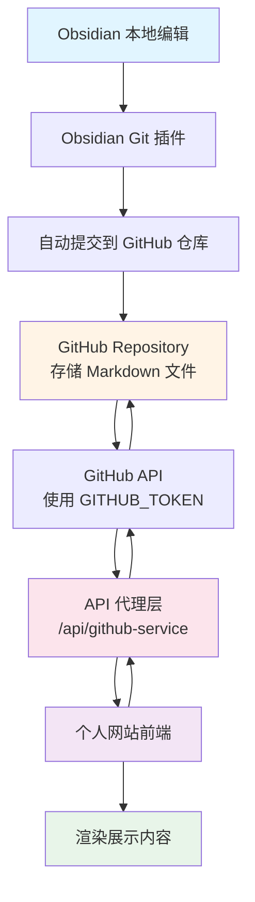
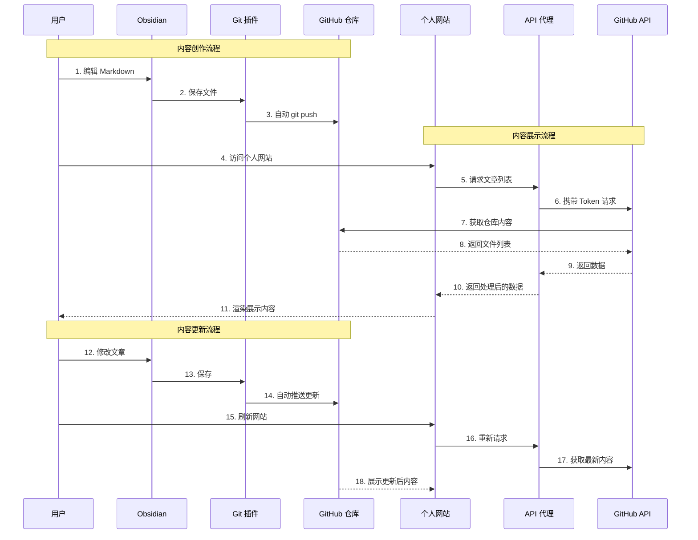

# 在工坊里捣鼓：用 Obsidian + Git 搭建个人博客

---

最近在工坊里捣鼓了点东西——终于把个人博客搭起来了。

说"终于"，是因为这事儿我拖了很久。倒不是不会做，而是一直在纠结"要不要做"和"怎么做得完美"。

今天想分享一下，我是怎么从"完美主义"的陷阱里爬出来，找到了一个适合自己的方案。


---

## 一、为什么拖了这么久

**关于记录习惯**

我平时用 Obsidian 记录，已经习惯了它的编辑体验。如果要做个人网站，就意味着：
- 要么放弃 Obsidian，在网站后台写
- 要么两边都写，手动同步

第一个选项不现实——我不可能放弃已经用习惯的工具。第二个选项太麻烦——光是想到"我要记得两边同时更新"，心智负担就让我望而却步。

更别提，如果要做网站编辑器，我还得开发一套存储方案、编辑器功能……这一想，就觉得太复杂了，干脆不做了。

**关于心理障碍**

现在回头看，我当时是典型的**完美主义思维**：
- 过度放大了过程的麻烦程度
- 把"可能会碰到的问题"都想得很严重
- 想"一口气吃成胖子"，觉得要一次性解决所有问题

结果就是：一直停在"想做"的阶段，从来没有真正开始。

直到我意识到：**也许我根本不需要把事情想得那么复杂。**

---

## 二、解决方案：前端与内容分离

核心思路很简单：

**我不需要在个人网站上"编辑"内容，只需要"展示"内容。**

具体来说：
1. 我在 Obsidian 里写文章（照常）
2. 用 Obsidian 的 Git 插件，自动提交到 GitHub
3. 个人网站直接从 GitHub 拉取内容展示

这样一来：
- ✅ 我还是在熟悉的 Obsidian 里写
- ✅ 不需要开发编辑器
- ✅ 不需要开发存储系统
- ✅ 不需要担心两边同步
- ✅ 所有编辑在一个地方完成

**简单说：Obsidian 是我的工坊，GitHub 是仓库，个人网站是展览厅。**

---

## 三、技术实现

### 系统架构

让我画个图，你一看就懂：



看起来挺复杂？其实只有三步：
1. **Obsidian → GitHub**（自动同步）
2. **网站 → GitHub**（读取内容）
3. **网站 → 浏览器**（展示给读者）

### 完整流程

如果你想看详细的操作步骤，这张图会更清楚：



简单来说：
- **我在 Obsidian 写 → Git 自动推送 → 网站自动更新**
- 全程自动化，我只需要专注写作

### 关于 GitHub API

这里有个技术细节需要注意：

GitHub API 有请求限制：
- 不带 Token：60 次/小时
- 带 Token：5000 次/小时

所以我的方案是：
1. 在环境变量里配置 `GITHUB_TOKEN`
2. 前端调用自己的 `/api/github-service` 代理
3. 代理层携带 Token 去请求 GitHub API
4. 避免 Token 暴露在客户端

**安全且够用。**

---

## 四、为什么这个方案适合我

### 1. 单一数据源

我只在 Obsidian 中编辑，Git 自动同步。不需要在多个地方维护内容，不需要记得"改了这边，也要改那边"。

**心智负担降到最低。**

### 2. 开发成本低

个人网站只需要"读"功能，不需要：
- ❌ 开发复杂的编辑器
- ❌ 开发存储系统
- ❌ 开发用户管理
- ❌ 开发同步逻辑

**只需要做好一件事：把 Markdown 渲染得好看。**

### 3. 技术栈熟悉

整个方案用的都是我熟悉的技术：
- Obsidian（日常在用）
- Git（前端必备）
- GitHub API（标准接口）
- Markdown 渲染（前端基础）

**没有新的学习成本，只是把现有工具组合起来。**

---

## 六、技术栈总结

给想参考的朋友一个清单：

**内容管理端**
- Obsidian（Markdown 编辑器）
- Obsidian Git 插件（自动同步）

**存储层**
- GitHub Repository（内容存储）
- Git（版本控制）

**后端**
- API 代理
- 环境变量（存储 `GITHUB_TOKEN`）

**前端**
- 个人网站（内容展示）
- Markdown 渲染器（解析和渲染）

**核心流程：**
```
Obsidian 编辑 
  → Git 自动推送 
    → GitHub 存储 
      → API 获取 
        → 网站展示
```

---

## 写在最后

在工坊里捣鼓的过程，其实就是不断"做减法"的过程。

一开始想得很复杂：要编辑器、要后台、要同步、要完美……越想越不敢开始。

后来发现，**我只需要一个能展示文章的地方，仅此而已。**

编辑？我有 Obsidian。
存储？我有 GitHub。
展示？写个前端就行。

就这么简单。

如果你也有"想做但一直没做"的项目，也许可以试试：
1. 列出核心需求（我只要展示文章）
2. 砍掉所有非必要功能（不需要编辑器）
3. 用现有工具组合（Obsidian + Git + GitHub）
4. 先做一个最简单的版本
5. 然后再慢慢优化

**完美是优秀的敌人。**

**开始，比完美更重要。**

---

这就是我在工坊里的最新作品。如果你对技术细节感兴趣，或者想看看实际效果，随时来酒馆找我聊。

下次见 🍂

---

**延伸阅读：**
- 如果你也在用 Obsidian，推荐试试 Git 插件
- 如果你想搭个人网站，这个方案值得参考
- 如果你也有"完美主义"的困扰，我们下次聊聊怎么破

**P.S.**  
这篇文章本身，就是在 Obsidian 里写的，然后自动同步到了我的个人网站上。你现在在公众号看到的，也是从 Obsidian 复制过来的。

**就是这么丝滑 😎**

当然这篇文章由 claude 美化过。哈哈哈哈哈