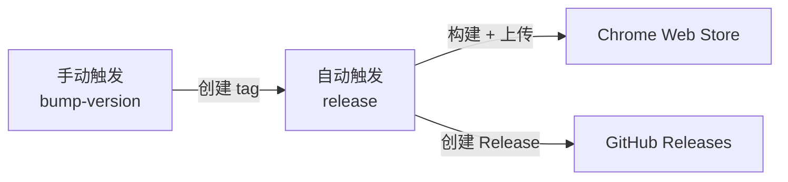

> 告别手动打包上传，一键发布到 Chrome Web Store

## 为什么要自动化发布

前两天介绍自己的 Chrome 插件时候，文章写于半夜，果然漏介绍东西了，这次来补上：我如何用 GitHub Actions 实现了最简化发布。

不过最近也踩了个大坑。有小伙伴反馈：装了插件后没法登录滴答清单。

经过一番排查，我想起来应该也是我这个自动化流程导致的——
- 第一次发布是我本地手动打包的，本地 `.env.local` 有滴答清单的 API 凭证，一切正常
- 第二次是 GitHub Actions 自动打包，但我没把这些凭证配到 GitHub Secrets 里，于是自动发布的版本就成了"阉割版"——构建成功，但运行时无法调用 API

而且尴尬的是自动发布成功后我偷懒没重新下载测试，直到用户反馈才发现问题 hhh

手动发布 Chrome 扩展的流程：**打包 → 登录 Chrome Web Store → 上传 → 填写更新说明 → 提交审核**。每次发布都要重复这套操作，不仅繁琐，还容易出错——比如忘记同步版本号、打包了错误的文件。

自动化发布带来的好处：
- **一键触发**：选择版本类型，剩下的交给 CI
- **版本一致性**：`package.json` 和 `manifest.json` 自动同步
- **质量保障**：发布前自动执行 lint 和类型检查

## 整体方案

我采用 **tag 驱动发布** 的设计，两个 Workflow 职责分离：

**bump-version.yml**：手动触发，选择版本类型（patch/minor/major），自动更新版本号并创建 git tag

**release.yml**：监听 tag 创建，执行构建、质量检查、上传到 Chrome Web Store

这种设计的好处是**关注点分离**：版本管理和发布逻辑解耦，也方便在本地手动创建 tag 触发发布。

> 📦 完整的 workflow 配置见 [GitHub 仓库](https://github.com/anthropics/first-glance/tree/main/.github/workflows)

## 准备工作

### 1. Chrome Web Store 开发者账号

需要支付 $5 的一次性注册费：[Chrome Web Store Developer Dashboard](https://chrome.google.com/webstore/devconsole)

### 2. 创建 OAuth 凭证

在 [Google Cloud Console](https://console.cloud.google.com/) 中：
1. 创建项目（或使用现有项目）
2. 启用 Chrome Web Store API
3. 创建 OAuth 2.0 凭证，类型选择「桌面应用」
4. 记录 `Client ID` 和 `Client Secret`
滴答清单的流程也类似，需要获取 id 和 secret
### 3. 获取 Refresh Token

这一步稍微麻烦，需要手动完成 OAuth 流程获取 `refresh_token`。

推荐使用 [chrome-webstore-upload-cli](https://github.com/nickytonline/chrome-webstore-upload-cli) 提供的交互式命令获取，或参考[官方文档](https://developer.chrome.com/docs/webstore/using-api)。

### 4. 配置 GitHub Secrets

![[Pasted image 20260121121554.png]]

在仓库 Settings → Secrets and variables → Actions 中添加：

| Secret 名称 | 说明 |
| --- | --- |
| `EXTENSION_ID` | 扩展 ID（在 Chrome Web Store 中查看） |
| `CWS_CLIENT_ID` | OAuth Client ID |
| `CWS_CLIENT_SECRET` | OAuth Client Secret |
| `CWS_REFRESH_TOKEN` | OAuth Refresh Token |
| `PAT` | GitHub Personal Access Token（见下文踩坑经验） |

如果你的扩展需要调用第三方 API（如滴答清单、Notion），这些 API 凭证也必须配置到 Secrets 中。

## 踩坑经验

这部分是我实际配置过程中遇到的问题，希望能帮你避坑。

### PAT vs GITHUB_TOKEN

这是最容易踩的坑：**默认的 `GITHUB_TOKEN` 无法触发其他 Workflow**。

如果你用 `GITHUB_TOKEN` 推送 tag，`release.yml` 不会被触发。这是 GitHub 的安全设计，防止 Workflow 循环触发。

**解决方案**：创建 [Personal Access Token (PAT)](https://github.com/settings/tokens)，赋予 `repo` 权限，在 checkout 时使用。

### 构建时环境变量缺失

这是一个隐蔽但致命的问题：**本地构建和 CI 构建的环境变量不一致**。

我的扩展需要滴答清单的 API 凭证才能登录。本地 `.env` 配置齐全，手动打包一切正常。但 GitHub Actions 构建时，这些环境变量压根不存在——Vite 构建不会报错，只会用 `undefined` 替代，结果就是发布了一个"能装但不能用"的版本。

**解决方案**：在构建前主动验证必要的环境变量，缺失时立即报错，避免发布有问题的版本。

**经验总结**：
- 本地能跑不代表 CI 能跑，环境变量是最容易被遗漏的差异点
- 自动发布后也要抽检验证，别完全信任自动化

### 限制触发分支

建议只允许在 main 分支触发版本发布，避免在开发分支误操作。

## 使用效果

配置完成后，发布流程变成：

![[Pasted image 20260121121106.png]]

1. 打开 GitHub Actions 页面
2. 选择 "Bump Version & Release"
3. 点击 "Run workflow"，选择版本类型
4. 等待自动完成 ☕

![[Pasted image 20260121121702.png]]
![[Pasted image 20260121121431.png]]

## 相关资源

- [chrome-webstore-upload-cli](https://github.com/nickytonline/chrome-webstore-upload-cli) - 命令行上传工具
- [Chrome Web Store API 文档](https://developer.chrome.com/docs/webstore/api) - 官方 API 文档
- [First Glance 完整配置](https://github.com/gwifloria/first-glance/tree/main/.github/workflows) - 本文的实际 CI/CD 配置
- https://developer.dida365.com/docs#/openapi  - 滴答清单官方 API 文档

