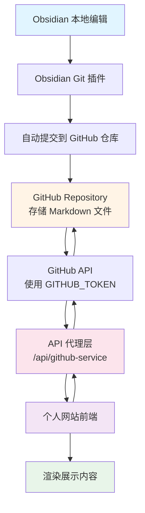
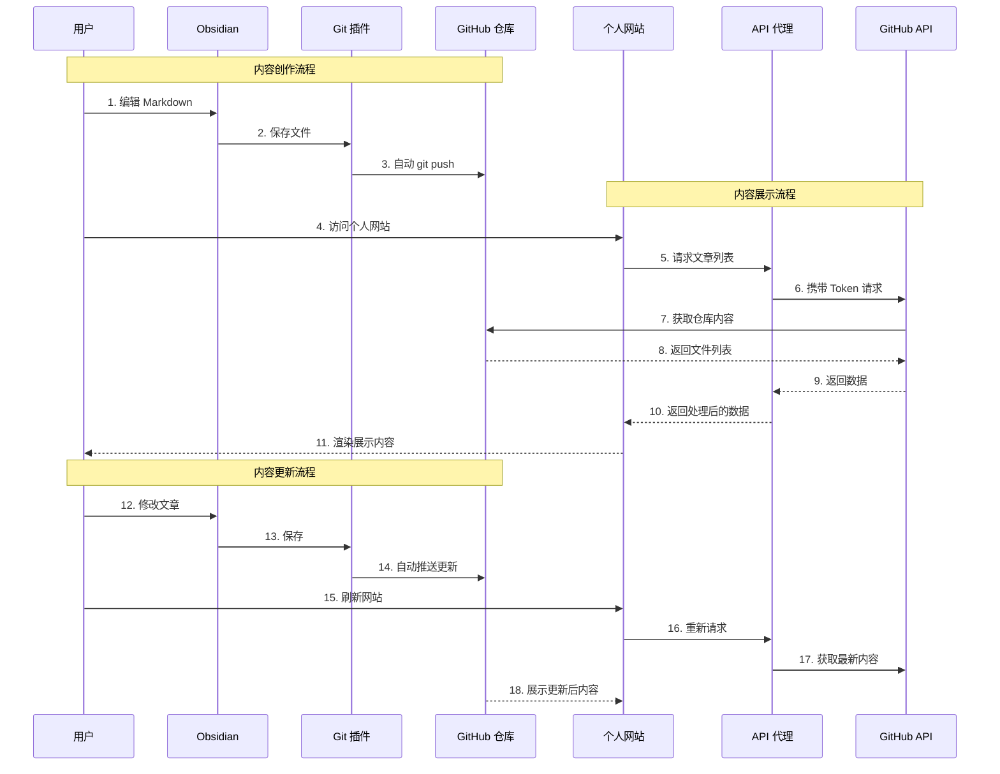
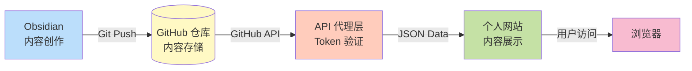

# 个人网站技术方案

## 为什么开始做个人网站

### 过去的顾虑

#### 1. 记录习惯
* 平时会写一些日记，但只是作为个人记录，并没有考虑过公开。
* 如果要公开，自己写的文章难免会涉及到编辑功能，而我已经习惯用 Obsidian 来记录。
* 如果要兼顾两端同步，可能需要额外开发一套编辑/存储方案，这让我觉得很麻烦，而且还要记得自己两边同时修改，增加心智负担。

#### 2. 心理障碍
* 我可能过度放大了过程的麻烦程度，把"可能会碰到的问题"都想得很严重，于是干脆不开始。
* 习惯于"完美主义"思维，想"一口气吃成胖子"，觉得要一次性解决所有问题才行。

---

## 解决思路

### 核心方案：前端与内容分离

我不希望前端展示项目存储 markdown 来实现 markdown 同步，而是利用 Obsidian 的 Git 插件，将 Obsidian 的 markdown 文件自动提交至远端仓库，自己的个人网站直接去 fetch 该仓库的文件列表及内容展示即可。

**优势：**
* 个人博客不需要实现编辑功能，保持"只读"展示即可
* 不需要担心两端同步问题
* 所有编辑都在熟悉的 Obsidian 中完成

---

## 技术实现

### GitHub API 与 Token

#### API 限制
* GitHub API 默认的请求次数限制大概是 60 次/小时（未授权）
* 加上 `GITHUB_TOKEN` 后，限制提升到 5000 次/小时

#### 安全方案
* Token 配置到环境变量中（不暴露在前端）
* 前端通过调用自己的 `/api/github-service` 代理
* 代理再去请求 GitHub API
* 避免 token 直接暴露在客户端

---

## 系统架构图

---

## 详细流程图

---

## 数据流向

---

## 技术栈

### 内容管理端
* **Obsidian** - Markdown 编辑器
* **Obsidian Git 插件** - 自动同步到 GitHub

### 存储层
* **GitHub Repository** - 内容存储
* **Git** - 版本控制

### 后端
* **API 代理** (`/api/github-service`)
* **环境变量** - 存储 `GITHUB_TOKEN`

### 前端
* **个人网站** - 内容展示
* **Markdown 渲染器** - 解析和渲染 Markdown

---

## 核心优势

### 1. 单一数据源
✅ 只在 Obsidian 中编辑，自动同步
✅ 不需要在多个地方维护内容

### 2. 版本控制
✅ Git 自动记录所有修改历史
✅ 可以随时回滚到任意版本

### 3. 安全可靠
✅ Token 不暴露在前端
✅ 通过代理层保护敏感信息

### 4. 简化开发
✅ 个人网站只需要"读"功能
✅ 不需要开发复杂的编辑器
✅ 不需要开发存储系统

### 5. 降低心智负担
✅ 熟悉的 Obsidian 编辑环境
✅ 自动同步，无需手动操作
✅ 一次编辑，处处可见

---

## API 限制对比

| 认证方式 | 请求限制 | 适用场景 |
|---------|---------|---------|
| 无认证 | 60次/小时 | 测试、小流量 |
| Personal Token | 5000次/小时 | 个人网站、中等流量 |
| OAuth App | 5000次/小时/用户 | 多用户应用 |

**当前方案：** 使用 Personal Token，足够个人博客使用

---

## 实现步骤

### Phase 1: 基础搭建
- [x] 在 GitHub 创建内容仓库
- [x] Obsidian 配置 Git 插件
- [x] 测试自动同步功能

### Phase 2: 后端开发
- [ ] 创建 API 代理服务
- [ ] 配置 GitHub Token
- [ ] 实现文件列表获取接口
- [ ] 实现文件内容获取接口

### Phase 3: 前端开发
- [ ] 搭建个人网站框架
- [ ] 对接 API 接口
- [ ] 实现 Markdown 渲染
- [ ] 实现文章列表展示

### Phase 4: 优化
- [ ] 添加缓存机制
- [ ] 优化加载速度
- [ ] 添加搜索功能
- [ ] 响应式设计

---

## 总结

### 核心流程
1. ✅ 在 Obsidian 中编辑内容
2. ✅ Git 插件自动提交到 GitHub
3. ✅ 个人网站通过 API 代理获取内容
4. ✅ 网站渲染展示内容
5. ✅ Obsidian 编辑后，网站自动更新

### 关键特点
* **单向同步**：Obsidian → GitHub → 网站
* **自动化**：Git 插件自动推送
* **安全性**：Token 通过代理层保护
* **简单性**：网站只读，无需编辑功能
* **无负担**：编辑和发布在同一个地方完成
